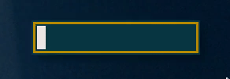

# robar-rs

[](https://crates.io/crates/robar)
[](https://docs.rs/robar)
[](https://opensource.org/licenses/MIT)
[](https://opensource.org/licenses/Apache-2.0)
[](https://travis-ci.org/jeffrey-xiao/robar-rs)



`robar` is a simple, but flexible system overlay bar for the X Window System (X11) using Unix
Sockets. Inspired by [`xob`](https://github.com/florentc/xob).

## Installation

`robar` can be installed with Cargo.

```
$ cargo install robar
```

## Usage

```
robar 0.1.0
Jeffrey Xiao <jeffrey.xiao1998@gmail.com>
A simple, but flexible system overlay bar for the X Window System (X11).

USAGE:
    robar [SUBCOMMAND]

FLAGS:
    -h, --help       Prints help information
    -V, --version    Prints version information

SUBCOMMANDS:
    help     Prints this message or the help of the given subcommand(s)
    hide     Hides the bar.
    show     Shows bar with a specific value and in a specific color profile.
    start    Starts daemon that listens to requests.
    stop     Stops daemon.
```

## Configuration

When `robar` is started (`robar start`), it looks for a configuration file in the following order:

1. The path specified by the `-c/--config` argument.
2. `$XDG_CONFIG_HOME/robar/robar.toml` if `$XDG_CONFIG_HOME` is set.
3. `$HOME/.config/robar/robar.toml`

### Global Configuration

Global configuration values are set under the `global` section in the config (`[global]`).

| Name                | Description                                                                                     | Default |
|---------------------|-------------------------------------------------------------------------------------------------|---------|
| `x_center_relative` | The x coordinate of the center of the bar relative to the active screen.                        | `0`     |
| `x_center_absolute` | The absolute offset of the center of the bar.                                                   |         |
| `y_center_relative` | The y coordinate of the center of the bar relative to the active screen.                        | `0`     |
| `y_center_absolute` | The absolute offset of the center of the bar.                                                   |         |
| `margin`            | The size of the margins.                                                                        | `0`     |
| `border`            | The size of the borders.                                                                        | `0`     |
| `padding`           | The size of the padding.                                                                        | `0`     |
| `height_relative`   | The height of the bar relative to the active screen.                                            | `0`     |
| `height_absolute`   | The absolute height of the bar.                                                                 |         |
| `width_relative`    | The width of the bar relative to the active screen.                                             | `0`     |
| `width_absolute`    | The absolute width of the bar.                                                                  |         |
| `timeout`           | The number of milliseconds before the bar fades. If timeout is set to 0, then the bar persists. | `1000`  |
| `fill_direction`    | The direction to fill the bar (up|down|left|right)                                              |         |

The height of the bar is defined as the `height_relative + height_absolute`.

The width of the bar is defined as the `width_relative + width_absolute`.

`margin`, `border`, and `padding` behave the same as in css.

### Color Profile Configuration

Color profile configuration values are set under the `colors.<profile>` section in the config
(`[colors.<profile>]`) where <profile> is the name of the color profile.

| Name         | Description                  |
|--------------|------------------------------|
| `foreground` | The color of the foreground. |
| `background` | The color of the background. |
| `border`     | The color of the border.     |

All values must be in the format `#RRGGBB`.

## Example Configuration

`examples/robar.toml`

```
[global]
x_center_relative = 0.9
x_center_absolute = 0
y_center_relative = 0.25
y_center_absolute = 0
height_absolute = 200
width_absolute = 30
padding = 2
border = 3
margin = 2
fill_direction = "up"

[colors.default]
foreground = "#eee8e5"
background = "#073642"
border = "#b58900"
```

## License

`robar` is distributed under the terms of both the MIT license and the Apache License (Version 2.0).

See [LICENSE-APACHE](LICENSE-APACHE) and [LICENSE-MIT](LICENSE-MIT) for more details.
